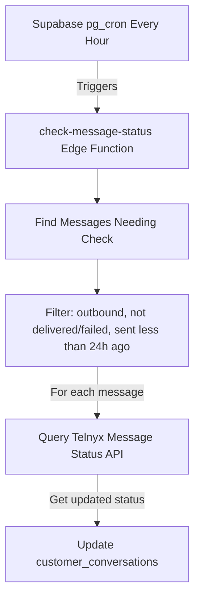

# Message Status Checker Documentation

## Overview

The **Message Status Checker** is an automated background system that periodically checks the delivery status of outbound SMS messages that haven't reached a final state (`delivered` or `failed`). It runs every hour via a Supabase cron job and updates message statuses in the `customer_conversations` table by querying the Telnyx API.

## Problem Solved

When you send SMS messages via Telnyx, some messages may get stuck in intermediate states like:
- `sending` - Message is being processed
- `sent` - Message left Telnyx but delivery not confirmed
- `uncertain` - Status unknown
- `queued` - Waiting to be sent
- `pending` - Initial state

This system automatically rechecks these messages for up to **24 hours** to determine their final delivery status, ensuring your UI shows accurate information to users.

## Architecture



## How It Works

### 1. Hourly Trigger
A PostgreSQL cron job (`pg_cron`) runs every hour and calls the `check-message-status` edge function.

### 2. Find Messages to Check
The function queries the `customer_conversations` table to find messages that meet these criteria:

**Include:**
- ✅ `direction` = `outbound` (only check messages YOU sent)
- ✅ `status` = `sending`, `sent`, `uncertain`, `queued`, or `pending`
- ✅ `timestamp` < 24 hours ago (only check recent messages)
- ✅ Has a `providerMessageId` (Telnyx message ID)

**Exclude:**
- ❌ `status` = `delivered` or `failed` (already finalized)
- ❌ Messages older than 24 hours (stop checking after 24h)
- ❌ `direction` = `inbound` (customer messages don't need status checks)

### 3. Query Telnyx API
For each message found, the function calls:
```
GET https://api.telnyx.com/v2/messages/{messageId}
```

This returns the current delivery status from Telnyx's system.

### 4. Update Database
If the status has changed, the function:
1. Updates the `status` field in the message object
2. Adds a new event to `statusDetails.events` array with:
   - `value`: New status
   - `source`: `"status-poll"`
   - `checkedAt`: Current timestamp
   - `classification`: `"success"`, `"failure"`, or `"uncertain"`

### 5. Stop Checking
Once a message reaches `delivered` or `failed`, it no longer matches the filter criteria and won't be checked again.

## File Structure

```
supabase/functions/check-message-status/
├── index.ts                    # Main edge function entry point
├── telnyxStatusPoller.ts       # Telnyx API integration
└── messageStatusChecker.ts     # Database queries and updates

supabase/sql/
└── setup_message_status_cron.sql  # Cron job setup script

MESSAGE_STATUS_CHECKER_DOCS.md  # This documentation
```

## Installation & Setup

### Step 1: Deploy the Edge Function

```bash
cd supabase
supabase functions deploy check-message-status
```

### Step 2: Set Environment Variable

Add your Telnyx API key as a secret:

```bash
supabase secrets set TELNYX_API_KEY=your_telnyx_api_key_here
```

### Step 3: Setup Cron Job

1. Open your Supabase Dashboard → SQL Editor
2. Open `supabase/sql/setup_message_status_cron.sql`
3. Replace placeholders:
   - `<YOUR-PROJECT-REF>` with your Supabase project reference
   - `<YOUR-ANON-KEY-OR-SERVICE-ROLE-KEY>` with your service role key
4. Execute the SQL script

### Step 4: Verify Setup

Check that the cron job is scheduled:

```sql
SELECT * FROM cron.job WHERE jobname = 'check-message-status-hourly';
```

## Testing

### Manual Trigger

Test the function without waiting for cron:

```bash
curl -X POST https://YOUR-PROJECT-REF.supabase.co/functions/v1/check-message-status \
  -H "Authorization: Bearer YOUR-ANON-KEY" \
  -H "Content-Type: application/json"
```

Expected response:

```json
{
  "success": true,
  "results": {
    "checked": 5,
    "updated": 3,
    "errors": 0,
    "skipped": 2
  },
  "timestamp": "2026-01-10T10:00:00.000Z"
}
```

### View Logs

Check execution logs:

```bash
supabase functions logs check-message-status --limit 50
```

### Verify Database Updates

Check recent status updates:

```sql
SELECT 
  customer_id,
  messages->-1->>'text' as last_message,
  messages->-1->>'status' as status,
  messages->-1->'statusDetails'->'events' as status_events,
  updated_at
FROM customer_conversations
WHERE (messages->-1->>'direction') = 'outbound'
ORDER BY updated_at DESC
LIMIT 10;
```

## Status Flow

### Status Transitions

```
Initial Send → sending → sent → delivered ✅
                    ↓       ↓
                uncertain → failed ❌
```

### Status Classifications

| Telnyx Status | Classification | Stop Checking? | Display in UI |
|--------------|----------------|----------------|---------------|
| `delivered` | success | ✅ YES | Green dot |
| `failed` | failure | ✅ YES | Red dot |
| `delivery_failed` | failure | ✅ YES | Red dot |
| `sent` | uncertain | ❌ NO | Amber dot |
| `sending` | uncertain | ❌ NO | Amber dot |
| `queued` | uncertain | ❌ NO | Amber dot |
| `pending` | uncertain | ❌ NO | Amber dot |
| `uncertain` | uncertain | ❌ NO | Amber dot |

## Configuration

### Change Check Frequency

Edit the cron schedule in `setup_message_status_cron.sql`:

```sql
-- Every 30 minutes
SELECT cron.schedule('check-message-status-half-hourly', '*/30 * * * *', $$...$$);

-- Every 2 hours
SELECT cron.schedule('check-message-status-two-hourly', '0 */2 * * *', $$...$$);
```

### Change 24-Hour Window

Edit `messageStatusChecker.ts` line 38:

```typescript
// Check messages up to 48 hours old
const fortyEightHoursAgo = new Date(Date.now() - 48 * 60 * 60 * 1000).toISOString()
```

### Rate Limiting

The function processes messages sequentially with a 100ms delay between API calls (line 161 in `index.ts`):

```typescript
// Adjust delay to avoid rate limits
await new Promise((resolve) => setTimeout(resolve, 100))
```

## Monitoring

### Cron Job History

View past executions:

```sql
SELECT 
  runid,
  jobid,
  start_time,
  end_time,
  status,
  return_message
FROM cron.job_run_details 
WHERE jobid = (SELECT jobid FROM cron.job WHERE jobname = 'check-message-status-hourly')
ORDER BY start_time DESC
LIMIT 20;
```

### Message Status Distribution

See how many messages are in each status:

```sql
WITH message_statuses AS (
  SELECT 
    jsonb_array_elements(messages)->>'status' as status,
    jsonb_array_elements(messages)->>'direction' as direction
  FROM customer_conversations
)
SELECT 
  status,
  COUNT(*) as count
FROM message_statuses
WHERE direction = 'outbound'
GROUP BY status
ORDER BY count DESC;
```

## Troubleshooting

### Issue: Cron job not running

**Check:**
1. Is `pg_cron` extension enabled?
   ```sql
   SELECT * FROM pg_extension WHERE extname = 'pg_cron';
   ```
2. Is the job scheduled?
   ```sql
   SELECT * FROM cron.job WHERE jobname = 'check-message-status-hourly';
   ```
3. Check cron logs for errors:
   ```sql
   SELECT * FROM cron.job_run_details ORDER BY start_time DESC LIMIT 5;
   ```

### Issue: Function returns "Missing TELNYX_API_KEY"

**Solution:**
Set the secret in your Supabase project:
```bash
supabase secrets set TELNYX_API_KEY=your_api_key
```

Verify it's set:
```bash
supabase secrets list
```

### Issue: No messages being checked

**Possible causes:**
1. All messages already have final status (`delivered` or `failed`)
2. All messages are older than 24 hours
3. Messages are missing `providerMessageId` field

**Check:**
```sql
SELECT 
  COUNT(*) as total,
  COUNT(*) FILTER (WHERE (msg->>'direction') = 'outbound') as outbound,
  COUNT(*) FILTER (WHERE (msg->>'status') IN ('sending', 'sent', 'uncertain')) as uncertain
FROM customer_conversations,
  jsonb_array_elements(messages) as msg;
```

### Issue: Telnyx API returning 404

**Possible causes:**
1. `providerMessageId` is incorrect or missing
2. Message has been archived by Telnyx (older than 7 days)

**Solution:**
The function will skip these messages and continue processing others.

## Performance

### Batch Processing
The function processes messages sequentially to avoid overwhelming the Telnyx API and database.

**Current limits:**
- 10 concurrent Telnyx API calls (configurable in `telnyxStatusPoller.ts`)
- 100ms delay between message updates

### Scalability
For high-volume scenarios (1000+ uncertain messages):
- Consider reducing check frequency to every 2 hours
- Implement batching in `messageStatusChecker.ts`
- Add Redis caching to avoid duplicate checks

## Security

### API Key Protection
- ✅ Telnyx API key stored as Supabase secret (encrypted)
- ✅ Never exposed in logs or responses
- ✅ Only accessible to edge function

### Database Access
- ✅ Uses service role key with full access
- ✅ Only updates `customer_conversations.messages` array
- ✅ No user data exposed externally

### Rate Limiting
- ✅ Built-in delays prevent API abuse
- ✅ Processes messages sequentially
- ✅ Respects Telnyx API rate limits

## Integration with Existing System

### No Changes to Existing Functions
This system operates independently:
- ✅ `inbound-message` function unchanged
- ✅ `send-campaign` function unchanged
- ✅ `send-direct-message` function unchanged
- ✅ Existing webhooks still work normally

### Data Sources
The checker uses **both sources** as specified:
1. **webhook_logs** - Historical reference (optional)
2. **customer_conversations** - Primary source for checking and updating

### UI Integration
Updates are immediately visible in the UI because:
- The checker updates `customer_conversations.messages` directly
- The UI reads from `customer_conversations`
- No additional code changes needed in React components

## Maintenance

### Disable the Cron Job
```sql
SELECT cron.unschedule('check-message-status-hourly');
```

### Re-enable the Cron Job
Re-run the setup SQL script.

### Update the Edge Function
```bash
supabase functions deploy check-message-status
```

Changes take effect immediately for new cron runs.

## Costs

### Telnyx API Calls
- Each message check = 1 API call
- Estimated: 10-50 checks/hour (depends on message volume)
- Telnyx typically allows thousands of API calls/month for free

### Supabase Resources
- Edge function execution: ~100ms per run
- Database queries: Minimal (< 5 queries per run)
- Well within free tier limits

## Future Enhancements

Possible improvements:
1. **SMS delivery reports** - Generate weekly reports of delivery rates
2. **Alert system** - Notify admins if delivery failure rate exceeds threshold
3. **Retry logic** - Automatically retry failed messages
4. **Analytics dashboard** - Visualize message status trends
5. **Webhook fallback** - Use webhooks as primary, polling as backup

## Support

For issues or questions:
1. Check logs: `supabase functions logs check-message-status`
2. Review cron history: `SELECT * FROM cron.job_run_details`
3. Verify Telnyx API connectivity manually
4. Check this documentation for troubleshooting steps

---

**Last Updated:** 2026-01-10  
**Version:** 1.0.0  
**Author:** SMS Automations System
