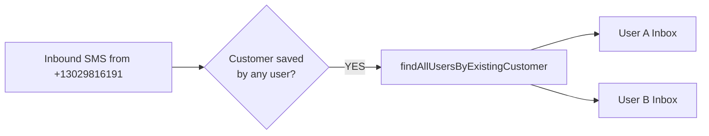
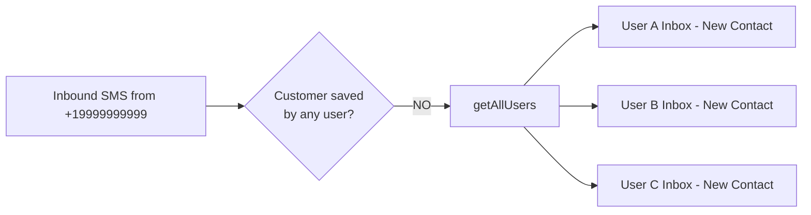

# Multi-User Inbound Routing - Implementation Summary

## Overview

Successfully implemented multi-user inbound message routing. The webhook now intelligently routes incoming SMS messages to all relevant users based on whether they have the customer saved.

---

## Changes Made

### 1. Added `getAllUsers()` Function

**File:** `supabase/functions/inbound-message/index.ts` (after line 221)

```typescript
const getAllUsers = async () => {
  const { data, error } = await supabaseAdmin
    .from('settings')
    .select('user_id, phone, business_phone, sender_name, first_name, last_name, email, company_name')
    .order('created_at', { ascending: true })

  if (error) {
    console.error('inbound-message: failed to load all users', error)
    return []
  }

  return data || []
}
```

**Purpose:** Fetches all user accounts in the system for routing unknown customer messages.

---

### 2. Updated Fallback Routing Logic

**File:** `supabase/functions/inbound-message/index.ts` (lines 520-589)

**Before:**
- Unknown customers routed to single "primary" user
- Other users never saw messages from unknown contacts

**After:**
- Unknown customers routed to ALL users in the system
- Each user gets a separate conversation with the unknown contact
- Users can independently respond

**Key Logic:**
```typescript
if (matchedUsers.length === 0) {
  const allUserSettings = await getAllUsers()
  
  // Route message to ALL users as new contact
  for (const userSettings of allUserSettings) {
    const userId = userSettings.user_id
    const existingCustomer = await findExistingCustomer(userId, fromNumber)
    const customerId = existingCustomer?.id ? String(existingCustomer.id) : null

    await appendConversationMessage({
      userId,
      customerId,
      customerPhone: fromNumber,
      // ... other params
    })
  }
}
```

---

### 3. Enhanced Response Logging

**File:** `supabase/functions/inbound-message/index.ts` (lines 626-636)

**For Known Customers:**
```json
{
  "success": true,
  "routedTo": "matched-users",
  "userCount": 2,
  "note": "Message routed to 2 user(s) with this customer saved"
}
```

**For Unknown Customers:**
```json
{
  "success": true,
  "routedTo": "all-users",
  "note": "Unknown customer - routed to all users"
}
```

---

## Routing Behavior

### Scenario 1: Customer Saved by Multiple Users



**Example:**
- User A has "Rohan Gilkes" (+13029816191)
- User B also has "Rohan Gilkes" (+13029816191)
- Rohan sends "Hello"
- Result: Both User A and User B see "Hello" in their Rohan conversations

---

### Scenario 2: Unknown Customer



**Example:**
- Unknown number +19999999999 sends "Hello"
- System has User A, User B, User C
- Result: All three users see new conversation "Incoming +19999999999"

---

## Key Features

✅ **Intelligent Routing**
- Customer saved by users → routes to those users only
- Unknown customer → routes to all users

✅ **Independent Conversations**
- Each user maintains separate conversation history
- User A's replies don't appear in User B's inbox
- Each can respond independently

✅ **Dynamic Customer Lookup**
- Uses numeric customer ID when available (from customers_data)
- Falls back to phone number for truly unknown contacts
- Prevents orphan conversation cleanup issues

✅ **Enhanced Logging**
- Webhook responses show routing decisions
- Includes user count and routing notes
- Easy to debug and monitor

---

## Testing

See `MULTI_USER_ROUTING_TESTS.md` for comprehensive testing guide.

**Quick Test:**
1. Deploy: `supabase functions deploy inbound-message`
2. Send SMS from customer saved by 2+ users
3. Verify all users see the message
4. Send SMS from unknown number
5. Verify all users see new contact

---

## Database Impact

### No Schema Changes Required
- Uses existing `customer_conversations` table
- Uses existing `customers` table with `customers_data` JSONB
- Uses existing `settings` table

### Query Changes
- Additional queries to fetch all users (for unknown contacts)
- Additional queries to check each user's customer list
- No performance impact expected (queries are efficient)

---

## Backward Compatibility

✅ **Fully Backward Compatible**
- Existing conversations remain intact
- Previous routing logic for known customers unchanged
- Only fallback behavior (unknown customers) changed

---

## Edge Cases Handled

| Case | Behavior |
|------|----------|
| Single user system | Works normally (routes to that one user) |
| Customer saved by zero users | Routes to all users |
| Customer saved by one user | Routes to that user only |
| Customer saved by all users | Routes to all users |
| No users in system | Returns error (no users found) |
| User has customer with same phone but different name | Routes using customer ID, respects user's naming |

---

## Deployment Checklist

- [x] Code changes implemented
- [x] Linting passed (no errors)
- [x] Test documentation created
- [ ] Deploy edge function: `supabase functions deploy inbound-message`
- [ ] Test with known customer (saved by 2+ users)
- [ ] Test with unknown customer
- [ ] Verify webhook logs
- [ ] Monitor for any errors in production

---

## Files Modified

1. **`supabase/functions/inbound-message/index.ts`**
   - Added `getAllUsers()` function
   - Updated fallback routing logic
   - Enhanced response logging

2. **`MULTI_USER_ROUTING_TESTS.md`** (new)
   - Comprehensive testing guide
   - SQL verification queries
   - Troubleshooting steps

3. **`MULTI_USER_ROUTING_SUMMARY.md`** (new - this file)
   - Implementation summary
   - Architecture diagrams
   - Deployment checklist

---

## Next Steps

1. **Deploy the function:**
   ```bash
   supabase functions deploy inbound-message
   ```

2. **Monitor initial messages:**
   ```bash
   supabase functions logs inbound-message --tail
   ```

3. **Run test scenarios** as outlined in `MULTI_USER_ROUTING_TESTS.md`

4. **Verify in production** with real customer messages

---

## Support

If issues arise:
1. Check edge function logs: `supabase functions logs inbound-message`
2. Check webhook_logs table in database
3. Verify customer_conversations table has expected entries
4. Review test documentation for common issues
